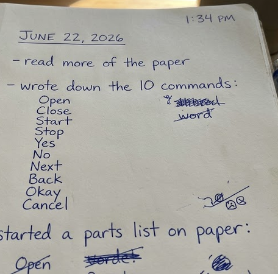

# SilentSpeak Journal

Total time: about 28 hours

## June 21, 2026

- 11:40 AM to 1:35 PM
- found a paper about reading jaw muscles through emg sensors in headphones
- decided to try something like that for outpost / stardance
- looked up grove emg boards and esp32-s3 on seeed and amazon

## June 22, 2026

- 1:34 PM to 3:28 PM
- read more of the paper
- wrote down the 10 commands
- started a parts list on paper

commands i picked:

```
Open, Close, Start, Stop, Yes, No, Next, Back, Okay, Cancel
```



## June 23, 2026

- 7:20 PM to 9:05 PM
- checked prices for grove emg detectors and esp32 board
- wrote BOM.csv with parts list for the grant
- figured out gpio pins for the four emg channels

pin map:

```
ch0 -> GPIO 1 (left masseter)
ch1 -> GPIO 2 (left temporalis)
ch2 -> GPIO 3 (right masseter)
ch3 -> GPIO 4 (right temporalis)
```

## June 24, 2026

- 4:10 PM to 5:55 PM
- sketched out the four parts of the system (sensors, esp32, laptop, app)
- started kicad schematic for the emg carrier pcb
- wired esp32-s3 to four grove emg detector slots on paper

## June 25, 2026

- 10:15 AM to 12:00 PM
- finished kicad schematic (saved as CAD/schematic.png)
- wrote down electrode spots (masseter and temporalis in each earmuff)
- routed power and gnd for all four emg channels

## June 26, 2026

- 6:45 PM to 8:40 PM
- opened arduino ide and started emg_streamer.ino
- got analogRead working on one gpio pin
- printed test values to serial monitor

first test code:

```cpp
sampleBuffer[i] = analogRead(EMG_PINS[i]);
Serial.println(sampleBuffer[i]);
```

## June 27, 2026

- 2:05 PM to 3:50 PM
- added hardware timer so it samples at 1000 hz
- hooked up all 4 gpio pins
- got csv output on serial: timestamp_ms,ch0,ch1,ch2,ch3

timer setup:

```cpp
static const int SAMPLE_RATE_HZ = 1000;
static const int EMG_PINS[4] = {1, 2, 3, 4};
```

sample lines from serial monitor:

```
142087,2048,2051,2049,2050
142088,2102,2047,2055,2048
142089,2098,2050,2052,2046
```

## June 28, 2026

- 9:40 AM to 11:30 AM
- added wifi and udp mode to the firmware for later
- left USE_WIFI at 0 for now since i will test over usb first
- cant test real emg yet because boards are not here

wifi flag in sketch:

```cpp
#define USE_WIFI 0
// set to 1 later for udp streaming
```

## June 29, 2026

- 3:15 PM to 5:10 PM
- started the python side
- wrote config.py for sample rate and window size (3 seconds)
- wrote preprocess.py with butterworth bandpass filter 20 to 450 hz

config values:

```python
SAMPLE_RATE_HZ = 1000
WINDOW_SEC = 3.0
BANDPASS_LOW_HZ = 20.0
BANDPASS_HIGH_HZ = 450.0
```

## June 30, 2026

- 8:00 PM to 9:50 PM
- built model.py with a 1d cnn called EMGNet
- tested it on random fake data to make sure input and output shapes work
- four channels in, 10 command classes out

model shapes:

```python
# input: (batch, 4 channels, 3000 samples)
# output: (batch, 10 classes)
```

ran a quick test:

```
>>> x = torch.randn(2, 4, 3000)
>>> y = model(x)
>>> y.shape
torch.Size([2, 10])
```

## July 1, 2026

- 1:50 PM to 3:45 PM
- wrote train.py, can train on synthetic data for now
- wrote record.py to save labeled windows from serial port
- made requirements.txt

train command:

```
python train.py --synthetic --epochs 10
```

example output:

```
epoch 1/10  loss=2.31
epoch 5/10  loss=1.04
epoch 10/10 loss=0.42
saved model to data/models/silentspeak.pt
```

## July 2, 2026

- 7:30 PM to 9:20 PM
- wrote inference.py for live classification
- wrote receiver.py for reading serial stream
- got the classify loop working with fake data

fake inference output:

```
predicted: Open  (0.82)
predicted: Stop  (0.71)
predicted: Yes   (0.65)
```

## July 3, 2026

- 11:10 AM to 12:55 PM
- made streamlit app in app/app.py (shows commands and model status)
- wrote docs/wiring.md for how to hook up grove boards
- built pcb layout in kicad and exported CAD/pcb-layout.png
- did 3d render of the board (CAD/pcb-3d-render.png)

## July 4, 2026

- 10:00 AM to 12:00 PM
- wrote README and added LICENSE and .gitignore
- put the whole repo together and committed it
- next: order phase 1 parts, flash esp32, check jaw signal on one channel

repo layout:

```
SilentSpeak/
  firmware/emg_streamer/
  python/
  app/
  docs/
```
