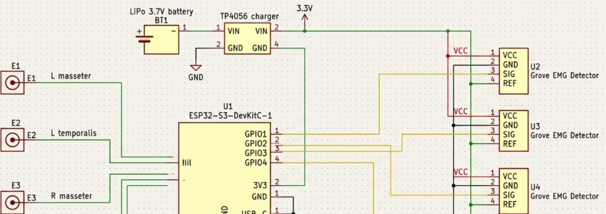
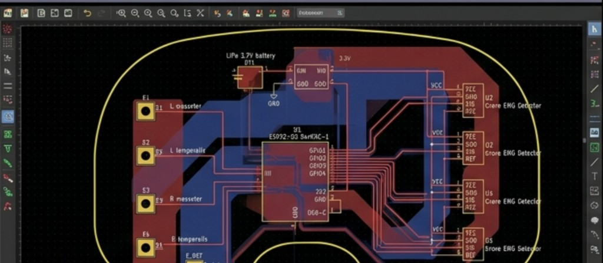
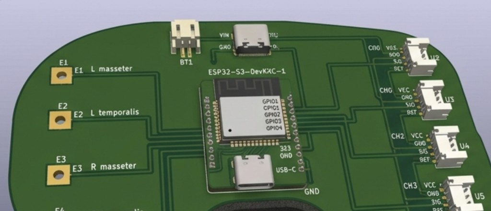

# SilentSpeak

> Silent-speech interface using multichannel surface EMG in over-ear headphones.

**Demo:** [luffy101-hash.github.io/silent-speak-emg](https://luffy101-hash.github.io/silent-speak-emg/) — interactive EMG simulator + command classifier

**This project is funded by [Hack Club Outpost](https://outpost.hackclub.com) / [Stardance](https://stardance.hackclub.com).**

## What is this?

SilentSpeak reads facial and jaw muscle activity through four Grove EMG sensors mounted in headphone earmuffs. When you mouth words without sound, an ESP32-S3 streams 4-channel EMG data to a laptop, a 1D CNN classifies 3-second windows into one of 10 commands, and a companion app displays the result with text-to-speech.

Inspired by Tang et al., *IEEE TIM* 2025 (arXiv:2504.13921)

## Grant

**Outpost grant request: Phase 1 bench test (~$170).** ESP32-S3, 4x Grove EMG detectors, breadboard, jumpers, and USB cable to validate the 4-channel EMG signal chain on a desk before headphone integration.

See [BOM.csv](BOM.csv) for the full parts list.

## Features

- 4-channel sEMG acquisition at 1000 Hz (ESP32-S3)
- 20 to 450 Hz Butterworth bandpass filtering
- 1D CNN classifier (10 silent commands)
- Real-time inference + TTS companion app
- Bench mode (USB serial) and wearable mode (Wi-Fi UDP)

## Commands

| Open | Close | Start | Stop | Yes |
|------|-------|-------|------|-----|
| No | Next | Back | Okay | Cancel |

## Hardware design (PCB)

Custom KiCad PCB for the EMG front-end. Full CAD exports in [`CAD/`](CAD/):

| Schematic | PCB layout | 3D render |
|-----------|------------|-----------|
|  |  |  |

## BOM

Download [BOM.csv](BOM.csv). Columns: Component, Qty, Price_USD, Link, Phase.

## Wiring

| EMG # | Position | ESP32-S3 GPIO |
|-------|----------|---------------|
| 1 | Left earmuff - masseter | GPIO 1 |
| 2 | Left earmuff - temporalis | GPIO 2 |
| 3 | Right earmuff - masseter | GPIO 3 |
| 4 | Right earmuff - temporalis | GPIO 4 |

See [docs/wiring.md](docs/wiring.md) for Grove pinout and bench-test setup.

## Quick start

### Demo site (GitHub Pages)

Static demo lives in [`docs/`](docs/). Enable once in the repo:

**Settings → Pages → Build from branch `main` → folder `/docs`**

Live URL: `https://luffy101-hash.github.io/silent-speak-emg/`

### Firmware

1. Open `firmware/emg_streamer/emg_streamer.ino` in Arduino IDE.
2. Board: **ESP32S3 Dev Module**. USB CDC on boot: enabled.
3. Flash. Open Serial Monitor at **115200** baud.
4. CSV output: `timestamp_ms,ch0,ch1,ch2,ch3`

Set `USE_WIFI 1` in the sketch for UDP streaming (configure `WIFI_SSID` / `WIFI_PASS`).

### App

```bash
streamlit run app/app.py
```

## Repo layout

```
SilentSpeak/
├── README.md
├── JOURNAL.md
├── BOM.csv
├── firmware/emg_streamer/  
├── python/                  
├── app/                       
├── CAD/           
└── docs/                      
```

## License

MIT. See [LICENSE](LICENSE).
